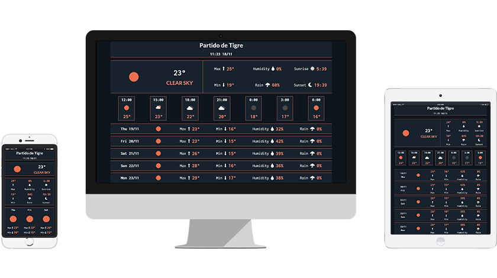

# Weather App

## Table of contents

- [General info](#general-info)
- [Showcase](#showcase)
- [Technologies](#technologies)
- [Setup](#setup)
- [Status](#status)

## General info
In this project I learned many things.

- I learned how to use Gulp to automate tasks. 
- I learned how to consume and manipulate data from an API. 
- I learned how to better organize my project folders.
- I learned to use Github branches (development/main).
- I learned how to create [a boilerplate for my projects](https://github.com/LGA-dev/bootstrap-sass-fontawesome-gulp-boilerplate)

I tried to make the UI as clean as possible, I need to improve a little more that aspect.

Time to learn React!

## Showcase

## Technologies

- HTML
- CSS
- Sass
- Bootstrap 4
- Javascript
- FontAwesome
- Gulp

## Setup

- [Demo](https://cranky-murdock-6375d5.netlify.app/)

## Status

Project is: _finished_
